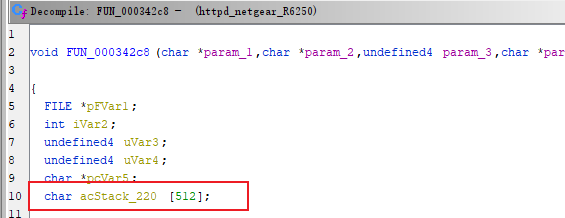
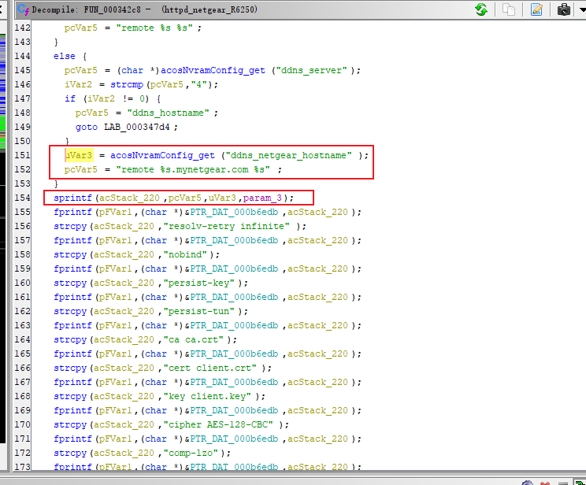
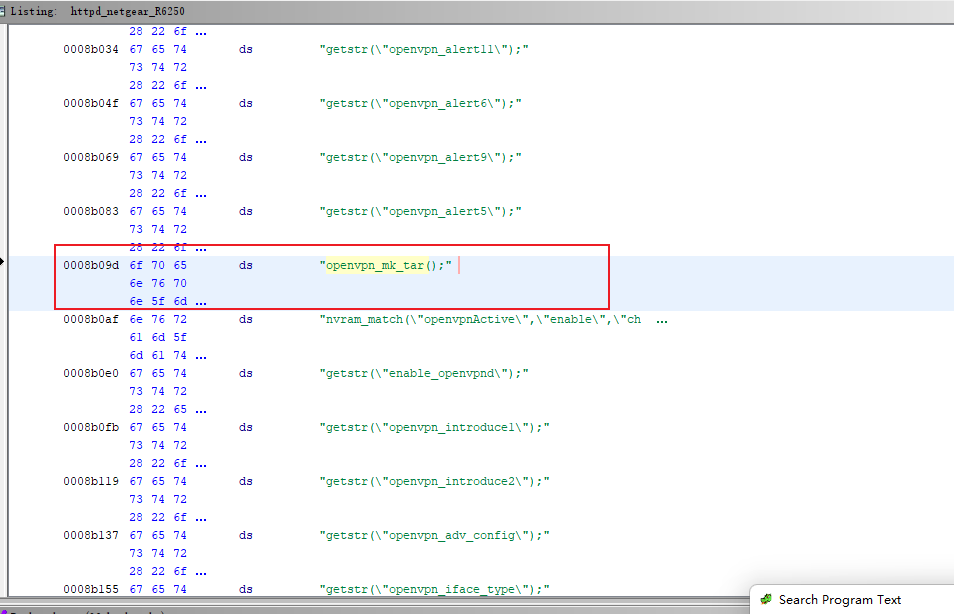
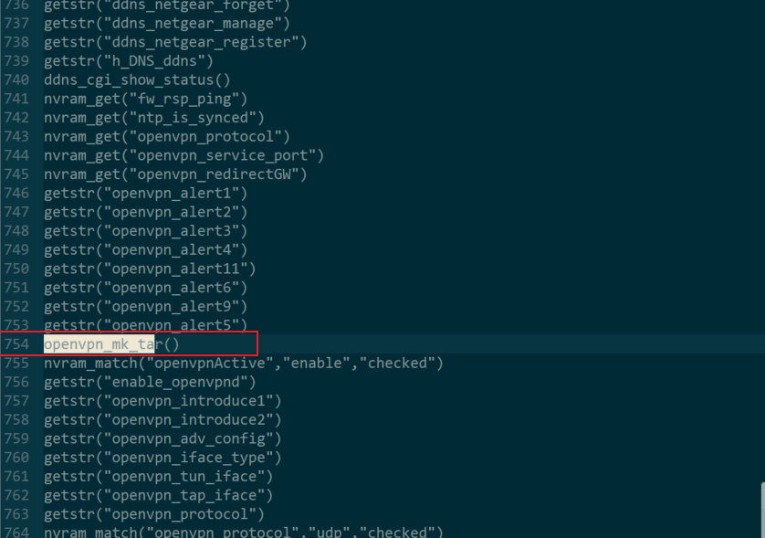
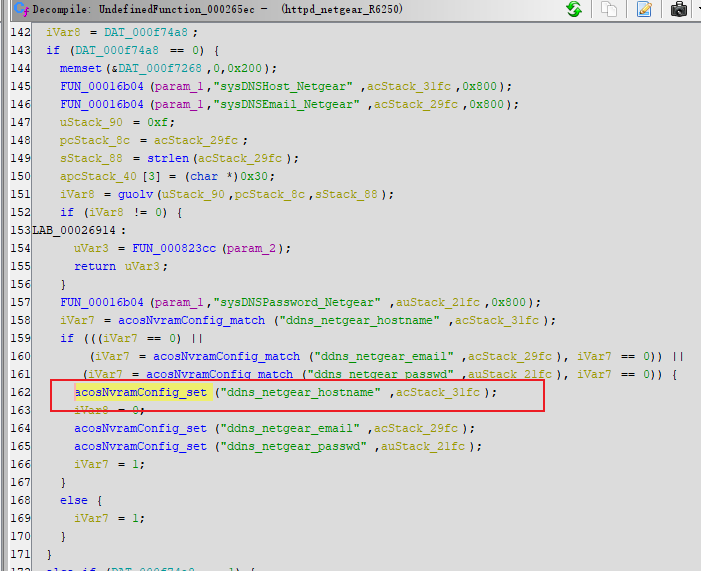

# 0x01  漏洞描述 #

netgear R6250 路由器存在身份验证后栈溢出漏洞，

# 0x02  固件分析 #

固件下载：https://www.downloads.netgear.com/files/GDC/R6250/R6250-V1.0.4.48_10.1.30.zip
直接binwalk用-Me提取即可

# 0x03  代码分析 #

分析/usr/sbin/httpd二进制文件，在函数FUN_000342c8中，从nvram获取ddns_netgear_hostname的值，复制到只有512大小acStack_220缓冲区。

函数FUN_00034cb4调用FUN_000342c8。

再发现，函数FUN_00034cb4的符号为openvpn_mk_tar。

在位置0x0008b09d出现`openvpn_mk_tar();`的字符串，同时上下文也大量类似字符串，看上去像函数调用，那怎么调用这些函数呢，其实是在/www目录下html文件通过<%number%>调用这些函数，比如，把上面这些函数调用字符串提取整理好，发现openvpn_mk_tar()函数的偏移量为754，然后通过<%754%>在html文件调用，所以openvpn_mk_tar()函数是请求OPENVPN.htm时调用的。

最后，在函数Function_000265ec设置ddns_netgear_hostname的值。

# 0x04  漏洞复现 #

运行Poc,发现能覆盖pc寄存器。

另外httpd也down。

# 0x05  漏洞修复 #

ddns_netgear_hostname复制到acStack_220缓冲区前，检查ddns_netgear_hostname大小。