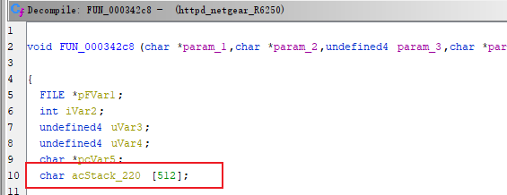
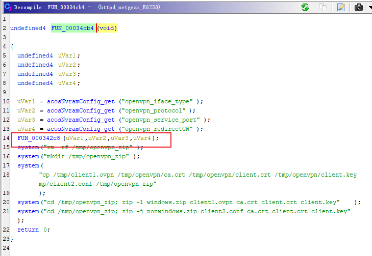
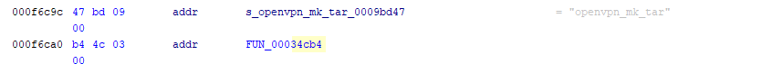
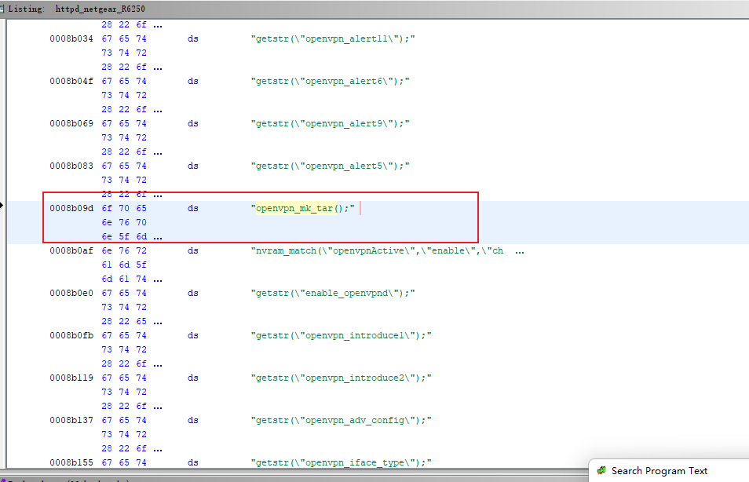
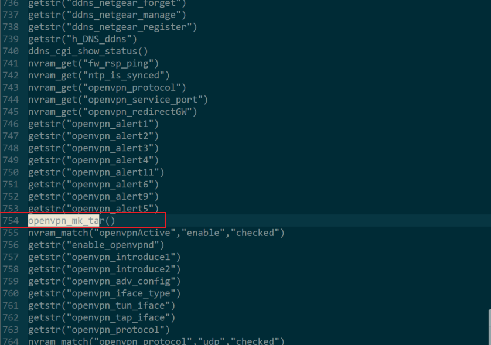
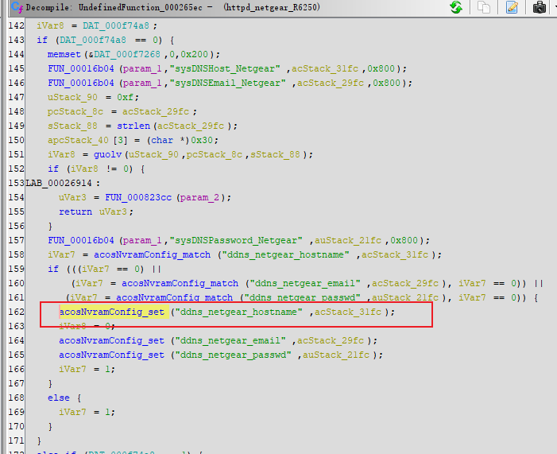
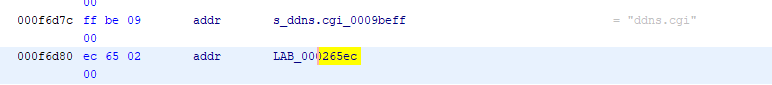
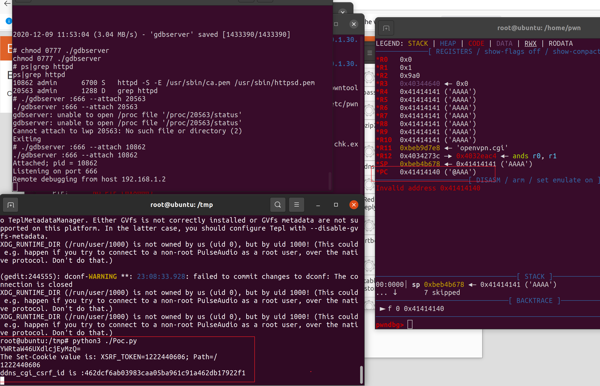
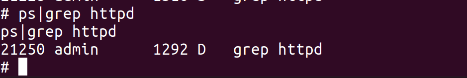

# 0x01  Vulnerability Description #

Netgear R6250 router is vulnerable to stack overflow after authentication.

# 0x02  Firmware Analysis #

Firmware download: ：https://www.downloads.netgear.com/files/GDC/R6250/R6250-V1.0.4.48_10.1.30.zip
You can extract it directly using binwalk with the option -Me.

# 0x03  Code Analysis #

Analyzing the binary file /usr/sbin/httpd, in the function FUN_000342c8, the value of ddns_netgear_hostname is obtained from nvram and copied to the buffer acStack_220, which has a size of only 512 bytes.

The function FUN_00034cb4 calls the function FUN_000342c8.

The symbol for the function FUN_00034cb4 is openvpn_mk_tar.

At offset 0x0008b09d, the string openvpn_mk_tar(); is found, along with similar strings in the surrounding context that resemble function calls. However, these functions are actually called in HTML files located in the /www directory using <%number%> syntax. For example, by extracting and organizing these function call strings, it is discovered that the offset of the openvpn_mk_tar() function is 754. It is then invoked in the HTML file using <%754%>, specifically when requesting the OPENVPN.htm file.

Finally, in the function Function_000265ec, the value of ddns_netgear_hostname is set.

# 0x04  Vulnerability Reproduction #

By running the POC, it is possible to overwrite the PC register.

Additionally, the httpd service is also turned off.

# 0x05  Vulnerability Fix #

Before copying ddns_netgear_hostname to the acStack_220 buffer, check the size of ddns_netgear_hostname.