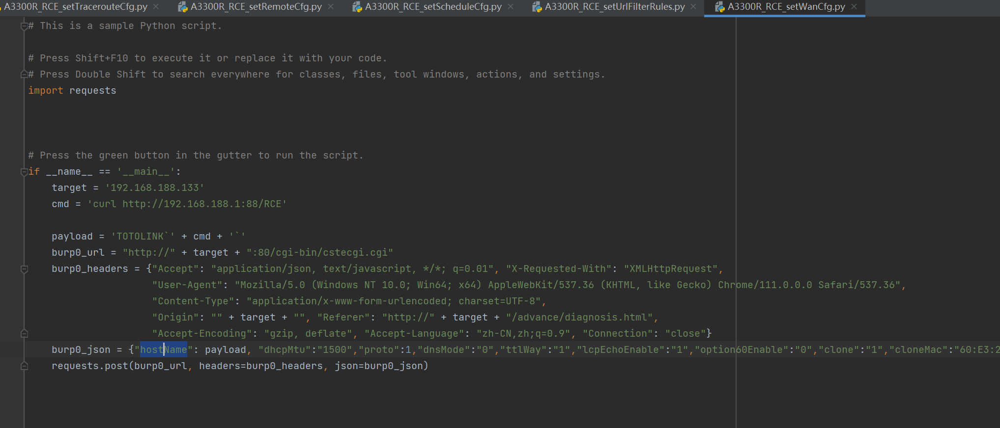
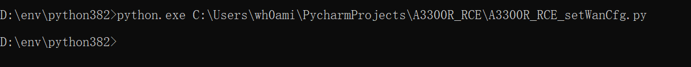
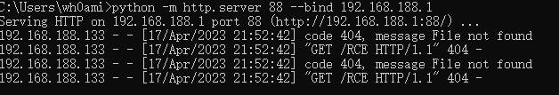

# Basic information #
	- ## CVE-ID: ## CVE-2023-31729
	- ## Vendor: ## Totolink
	- ## Product: ## A3300R - V17.0.0cu.557_B20221024
	- ## Firmware version: ## the latest V17.0.0cu.557_B20221024 firmware version
	- ## Type: ## command injection

# Vulnerability description #
FIRMWA DOWNLOAD: HTTPS://WWW.TOTOLINK.CN/DATA/UPLOAD/20230228/EEA9795866EA68EE471C1B6573A370E1.RAR

Totolink a3300r v17.0.0cu.557 router has a command injection vulnerability in the request /cgi-bin/cstecgi.cgi by funcsion setddnscfg. 
Totolink a3300r v17.0.0cu.557 router has a command injection vulnerability in the request /cgi-bin/cstecgi.cgi by funcsion setiptvcfg. 
Totolink a3300r v17.0.0cu.557 router has a command injection vulnerability in the request /cgi-bin/cstecgi.cgi by funcsion setipv6cfg. 
Totolink a3300r v17.0.0cu.557 router has a command injection vulnerability in the request /cgi-bin/cstecgi.cgi by funcsion setlancfg. 
Totolink a3300r v17.0.0cu.557 router has a command injection vulnerability in the request /cgi-bin/cstecgi.cgi by funcsion setremotecfg. 
Totolink a3300r v17.0.0cu.557 router has a command injection vulnerability in the request /cgi-bin/cstecgi.cgi by funcsion setschedulecfg. 
Totolink a3300r v17.0.0cu.557 router has a command injection vulnerability in the request /cgi-bin/cstecgi.cgi by funcsion settraceroutecfg. 
Totolink a3300r v17.0.0cu.557 router has a command injection vulnerability in the request /cgi-bin/cstecgi.cgi by funcsion seturlfilterrules.
Totolink a3300r v17.0.0cu.557 router has a command injection vulnerability in the request /cgi-bin/cstecgi.cgi by funcsion setwancfg.

# Vulnerability Proof #
## run Poc ##

# repair suggestion #
Filter characters such as **` $ | & ;** for the hostname parameter in the setwancfg function.